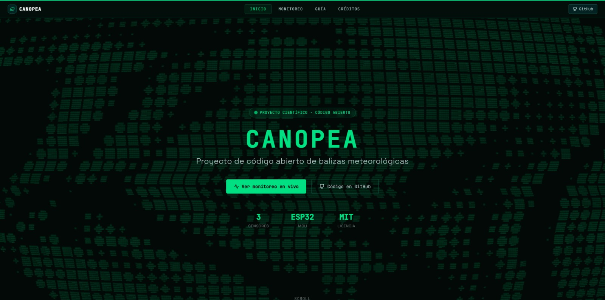
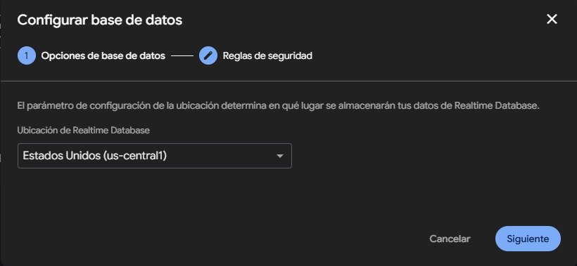
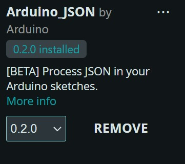

# 🌿 Canopea — Balizas Meteorológicas de Código Libre

[](https://opensource.org/licenses/MIT)
[](https://nextjs.org/)
[](https://www.espressif.com/)



**Canopea** es un sistema de código abierto para el monitoreo de la calidad del aire. Consiste en balizas autónomas construidas con un microcontrolador ESP32 y sensores electroquímicos de gas de la familia MQ. Los sensores ocupados en este proyecto son los MQ-2, MQ-7 y MQ-135 

Diseñado como un proyecto de investigación científica para el **XXXV Concurso Estatal de Aparatos y Experimentos de Física**, Canopea busca facilitar el acceso a información medioambiental con hardware accesible para cualquier estudiante de nivel medio superior o superior.

---

##  Inicio rápido (Adaptación web)

El ecosistema web consta de un Dashboard en tiempo real, construido con **Next.js 14**, **Tailwind CSS** y gráficos impulsados por **Chart.js** y **Leaflet**.

```bash
# 1. Clonar el repositorio
git clone https://github.com/Zev3n7/canopea.git
cd canopea

# 2. Instalar dependencias
npm install  # o pnpm install / yarn install

# 3. Configurar variables de entorno (Opcional, habilita panel Firebase en lugar de demo)
cp .env.local.example .env.local
# Edita .env.local con las credenciales de tu proyecto de Firebase.

# 4. Iniciar entorno de desarrollo
npm run dev
# 👉 Disponible en http://localhost:3000
```

---

## 🗄️ Configuración de Firebase Cloud Firestore

Canopea utiliza **Firebase** como el backend en tiempo real para recibir, procesar y transmitir los datos recolectados por las balizas conectados mediante la opcion de firebase de crear una app web.

1. Ingresa a la [Consola de Firebase](https://console.firebase.google.com/) y crea un nuevo proyecto ded tipo **FireStore**. *Tip: Selecciona el servidor (región GCP) más cercano a tu país (ej. `us-central1` o Ciudad de México).*
2. Habilita **Cloud Firestore** en modo de producción en se va a ocupar una prueba de uso de base de datos de 30 dias para realizar pruebas sin costo.

3. Selecciona dentro de la pestaña de configuración de proyecto la opcion de agregar app y seguir las instrucciones, agregando nombre y en caso de no tener hosting se puede ocupar el que proporciona firebase. En este proyecto se ocupara **Vercel** como hosting gratuito.

3. Actualiza las **Reglas de Seguridad** para permitir lecturas al público pero restringir la escritura a clientes autenticados (opcional para desarrollo inicial):
   ```javascript
   rules_version = '2';
   service cloud.firestore {
     match /databases/{database}/documents {
       match /{document=**} {
         allow read, write if true; // Esta configuración de reglas permite enviar datos de forma libre por lo que puede ser vulnerable, se recomienda en futuras actualizaciónes mejorar la seguridad del servidor
       }
     }
   }
   ```
4. En la base de datos Firestore, crea una Colección inicial llamada `balizas`.
5. Dentro de `balizas`, crea un documento referenciando tu nodo, por ejemplo `baliza-001`. Agrega la metadata:
   ```json
   { "nombre": "Baliza-001" }
   ```
6. Obtén la configuración Web en *Configuración del Proyecto > Mis apps* y transfiere las variables a tu archivo `.env.local` en el repositorio del frontend.

---

## 🧮 Algoritmo AQI de Canopea

El sistema incorpora un algoritmo propio para calcular el **Índice de Calidad del Aire (AQI)** general evaluando el impacto ecosistémico de tres sensores distintos en simultáneo.

### ¿En qué se basa?
El algoritmo compara la concentración en Partes por Millón (ppm) arrojada por cada sensor iterativamente frente a su **Límite de Exposición Seguro (Umbral Máximo)** predefinido:
- **MQ-2 (Gases combustibles):** Límite 1000 ppm
- **MQ-7 (Monóxido de Carbono):** Límite 200 ppm
- **MQ-135 (VOC / Amoníaco):** Límite 150 ppm

### Funcionamiento:
1. **Normalización Relativa:** Cada lectura en crudo fluye a través de una función de peso que calcula qué porcentaje del límite máximo de peligro representa ese valor (*Impacto Relativo* `(ppm_actual / umbral) * 100`).
2. **Aislamiento del Factor Crítico:** El algoritmo itera las tres métricas y aísla como *"Contaminante Principal"* exclusivamente al gas que alcance el **mayor porcentaje** relativo. 
3. **Escalonamiento Semántico:** Finalmente, el porcentaje más alto se evalúa y clasifica a través de las escalas dictadas en `src/lib/aqi.ts` y reacciona entregándonos el rango exacto de riesgo y los consejos sanitarios:
   - `0 - 50%` 🟢 BUENA (Riesgo Bajo)
   - `51 - 100%` 🟡 ACEPTABLE (Riesgo Moderado)
   - `101 - 150%` 🟠 MALA (Riesgo Alto)
   - `151 - 200%` 🔴 MUY MALA (Riesgo Muy Alto)
   - `> 200%` 🟣 EXTREMADAMENTE MALA (Riesgo Extremadamente Alto)

*Nota: La clasificación semántica y de colores se encuentra alineada con el **Índice Aire y Salud** oficial del Gobierno de la CDMX (NOM-172-SEMARNAT-2019).*

---

## ⚙️ Código del Microcontrolador (ESP32)

El ESP32 actúa como el componente encargado del sensado. Este esquinero en código C++ lee periódicamente las variaciones analógicas de voltaje de los sensores (MQ-2, MQ-7 y MQ-135) y transmite la carga útil (payload JSOn) por medio de WiFi al backend.


*Nota: Este ejemplo requiere el uso de la librería `Firebase_ESP_Client` para Arduino IDE.*



```cpp
#include <WiFi.h> // Modulo para conectar con WIFI, escanea las redes cercanas y mediante SSID y la contraseña se conecta
#include <HTTPClient.h> // Realizar peticiones GET (para obtener datos) y POST (para enviar datos), además de manejar códigos de respuesta HTTP (como el famoso 404 o el 200 OK).
#include <ArduinoJson.h> //Extraer valores específicos de una cadena de texto JSON compleja o empaquetar variables del código en un objeto JSON para enviarlo.
#include <time.h> // Configurar zonas horarias, manejar horarios de verano y convertir marcas de tiempo (timestamps) en formatos legibles (Hora:Minutos:Segundos).

// --- CONFIGURACIÓN WiFi ---
const char* ssid     = "Nombre de la red (Cambiar a la tuya, ejemplo:Buap_Estudiantes)";
const char* password = "Contraseña de tu red WIFI, ejemplo: ContraseñaBuap123";

// --- CONFIGURACIÓN FIRESTORE ---
const String PROJECT_ID = "ID de tu proyecto de firebase";

// URL apunta a la subcolección lecturas (POST aquí = ID automático), es necesario tener creada la estrucuta de balizas, baliza-001 y lecturas con un primer dato
String firestoreURL = "https://firestore.googleapis.com/v1/projects/" + PROJECT_ID +
                      "/databases/(default)/documents/balizas/baliza-001/lecturas";

// --- Pines al que esta conectado cada sensor ---
const int PIN_MQ2   = 35;
const int PIN_MQ7   = 32;
const int PIN_MQ135 = 34;

// ===================== Estructura =====================
void setup() {
  Serial.begin(115200);

  pinMode(PIN_MQ2,   INPUT);
  pinMode(PIN_MQ7,   INPUT);
  pinMode(PIN_MQ135, INPUT);

  Serial.print("Conectando a WiFi");
  WiFi.begin(ssid, password);
  while (WiFi.status() != WL_CONNECTED) {
    delay(500);
    Serial.print(".");
  }
  Serial.println("\n WiFi conectado exitosmante");

  // Sincronizar hora con servidor NTP para el timestampValue
  configTime(-6 * 3600, 0, "pool.ntp.org", "time.nist.gov");
  Serial.print("Sincronizando hora NTP");
  struct tm timeinfo;
  while (!getLocalTime(&timeinfo)) {
    delay(500);
    Serial.print(".");
  }
  Serial.println("\n Hora sincronizada exitosamente");
}

// ===================== OBTENER TIMESTAMP =====================
String getTimestampISO() {
  struct tm timeinfo;
  if (!getLocalTime(&timeinfo)) return "1970-01-01T00:00:00Z";

  char buf[30];
  strftime(buf, sizeof(buf), "%Y-%m-%dT%H:%M:%SZ", &timeinfo);
  return String(buf);
}

// ===================== FUNCIÓN PARA CONEXIÓN CON FIRESTORE =====================
void enviarAFirestore(float mq2_ppm, float mq7_ppm, float mq135_ppm) {
  if (WiFi.status() != WL_CONNECTED) {
    Serial.println("Sin WiFi, reintentando...");
    WiFi.reconnect();
    return;
  }

  HTTPClient http;
  http.begin(firestoreURL);
  http.addHeader("Content-Type", "application/json");

  // DoubleValue para sensores, timestampValue para la hora real (Aadaptación del formato de los sensores al formato que recibe la base de datos)
  String ts = getTimestampISO();
  String jsonBody = "{\"fields\":{"
    "\"mq2_ppm\":{\"doubleValue\":"    + String(mq2_ppm,   2) + "},"
    "\"mq6_ppm\":{\"doubleValue\":"    + String(mq7_ppm,   2) + "},"
    "\"mq145_ppm\":{\"doubleValue\":"  + String(mq135_ppm, 2) + "},"
    "\"timestamp\":{\"timestampValue\":\"" + ts + "\"}"
  "}}";

  //POST = crea documento nuevo con ID automático en la subcolección
  int httpCode = http.POST(jsonBody);

  if (httpCode == 200 || httpCode == 201) {
    Serial.println("Lectura guardada en balizas/baliza-001/lecturas/[AUTO-ID]");
    Serial.println("   Timestamp: " + ts);
    Serial.print("   mq2_ppm: ");   Serial.print(mq2_ppm);
    Serial.print(" | mq6_ppm: ");   Serial.print(mq7_ppm);
    Serial.print(" | mq145_ppm: "); Serial.println(mq135_ppm);
  } else {
    Serial.print(" Error HTTP: ");
    Serial.println(httpCode);
    Serial.println(http.getString());
  }

  http.end();
}

// ===================== LOOP =====================
void loop() {
  float mq2_ppm   = (analogRead(PIN_MQ2)   / 4095.0) * 1000.0;
  float mq7_ppm   = (analogRead(PIN_MQ7)   / 4095.0) * 500.0;
  float mq135_ppm = (analogRead(PIN_MQ135) / 4095.0) * 400.0;

  enviarAFirestore(mq2_ppm, mq7_ppm, mq135_ppm);

  delay(60000);
}
```

---

## 🎨 Arquitectura de Diseño

El proyecto emplea de forma nativa un sistema de diseño `Tech-Noir / Sci-Fi` de alto contraste en `Tailwind` pensado.
- **Acento Primario:** `Caribbean Green (#00DF81)` para botones visuales y notificaciones `Activas`.
- **Fondo General:** `Rich Black (#030D09)` y `Dark Jungle (#032221)`.
- **Paletas Auxiliares:** `Cyan, Olive, Teal` que identifican contextualmente la semántica y categorías en los componentes de datos y diagramas cartesianos del dashboard.

---

## 📝 Licencia / Autoría

Desarrollado bajo licencia **MIT** por el equipo de investigación de la **Preparatoria 2 de Octubre de 1968**. 
Agradecemos el apoyo a la Física descentralizada. Tienes el permiso de clonar y bifurcar este repositorio, conectar más Balizas y generar mapas dinámicos.

*«Lo que no se mide, no se puede estudiar ni mejorar.»*
